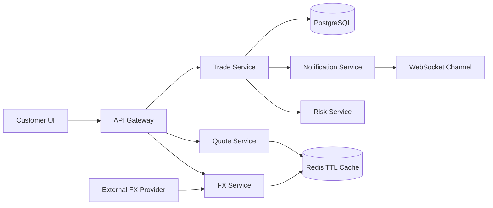

# Bank-Grade Foreign Exchange Trading Platform MVP

This repository contains a demo-grade but architecture-faithful FX trading MVP based on the provided product specification.

## What Is Included

- Next.js trading workspace with market overview, quote search, trade execution, trade lifecycle, audit log, notifications, and records.
- FastAPI backend with currency, rate, quote, trade, status log, notification, and WebSocket endpoints.
- Quote TTL and status model: `ACTIVE -> USED` or `ACTIVE -> EXPIRED`.
- Trade state machine: `CREATED -> QUOTE_LOCKED -> PENDING_RISK_CHECK -> CONFIRMED -> SETTLEMENT_PENDING -> SETTLED`.
- Risk checks for quote expiry, unsupported currency, single-trade limit, and idempotent submission.
- PostgreSQL schema and seed data for the production data model.
- Docker Compose for web, API, PostgreSQL, and Redis.
- Pitch deck and speaker notes under `pitch/`.

## Demo Run

Frontend only:

```bash
pnpm install
pnpm dev
```

Open `http://localhost:3000`.

Backend only:

```bash
cd backend
python -m venv .venv
.venv\Scripts\activate
pip install -r requirements.txt
uvicorn app.main:app --reload
```

Open Swagger at `http://localhost:8000/docs`.

Full stack with infrastructure:

```bash
docker compose up --build
```

## Demo Story

1. Open dashboard and show live USD/EUR bid/ask movement.
2. Use `Sell USD`, `Buy EUR`, `Amount 10000`.
3. Click `Get Quote`.
4. Explain the 30-second TTL and locked executable rate.
5. Click `Submit Trade`.
6. Watch the state machine move through risk check, confirmation, settlement, and final notification.
7. Open audit and records tabs to show traceability.
8. Open Swagger to show how the frontend maps to backend endpoints.

## Backend API

- `GET /currencies`
- `GET /fx-rates`
- `GET /fx-rates/{from_currency}/{to_currency}`
- `POST /quotes`
- `GET /quotes/{quote_id}`
- `POST /trades` with optional `Idempotency-Key`
- `GET /trades`
- `GET /trades/{trade_id}`
- `GET /trades/{trade_id}/logs`
- `GET /notifications`
- `WS /ws/fx-rates`

## Architecture



## Financial Data Standards

- Application money and rates use `Decimal`, not `float`.
- PostgreSQL money/rate fields use `NUMERIC(20,8)`.
- Currency pairs use `BASE/QUOTE`, for example `USD/EUR`.
- API timestamps use ISO 8601.

## Pitch Assets

- `pitch/fx-trading-platform-pitch.pptx`
- `pitch/speaker-notes.md`

The deck is structured for four speakers: product and demo, frontend, backend and data, DevOps and roadmap.
