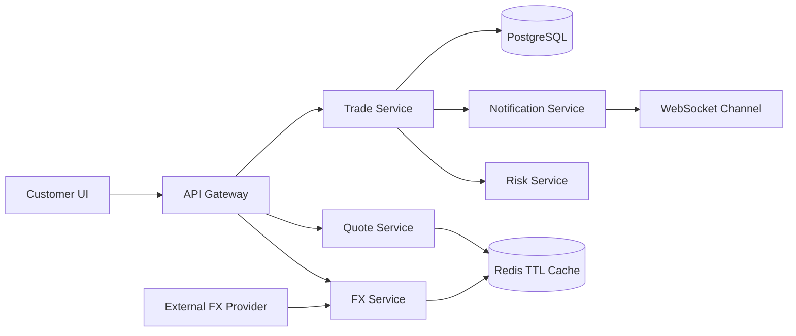

# Bank-Grade Foreign Exchange Trading Platform MVP

This repository contains a local, full-stack demo for a bank-grade Foreign Exchange Trading Platform. The canonical review URL is:

```text
http://localhost:9000
```

GitHub Pages is no longer used for this project. Review, demo, and partner walkthroughs should use the local host flow below.

## What Is Included

- Next.js trading workspace with dashboard, quote search, trade execution, lifecycle, audit log, notifications, and records.
- FastAPI backend with currencies, rates, quotes, trades, status logs, notifications, and WebSocket endpoints.
- Quote TTL model: `ACTIVE -> USED` or `ACTIVE -> EXPIRED`.
- Trade state machine: `CREATED -> QUOTE_LOCKED -> PENDING_RISK_CHECK -> CONFIRMED -> SETTLEMENT_PENDING -> SETTLED`.
- Risk checks for quote expiry, unsupported currency, single-trade limit, and idempotent submission.
- PostgreSQL schema and seed data for the production data model.
- Docker Compose for web, API, PostgreSQL, and Redis.
- Pitch deck and 4-person speaker notes under `pitch/`.

## Install

From the repository root:

```bash
pnpm install
```

If `pnpm` is not available, enable it through Corepack or install it once:

```bash
corepack enable
corepack prepare pnpm@latest --activate
```

## Run the Local Website on Port 9000

Use this command for the main demo website:

```bash
pnpm dev:9000
```

Open:

```text
http://localhost:9000
```

The app should show the FX Treasury workspace with:

- Market overview
- USD/EUR quote flow
- 30-second quote TTL
- Submit Trade action
- Trade lifecycle timeline
- Trade records
- Audit log
- Architecture tab
- Notification center

## Optional Backend API

The frontend demo can be reviewed on `localhost:9000` without starting the backend. To review the API and Swagger docs:

```bash
cd backend
python -m venv .venv
.venv\Scripts\activate
pip install -r requirements.txt
uvicorn app.main:app --reload --port 8000
```

Open:

```text
http://localhost:8000/docs
```

## Full Stack With Infrastructure

To run the web app, API, PostgreSQL, and Redis together:

```bash
docker compose up --build
```

Docker Compose exposes:

- Web: `http://localhost:3000`
- API: `http://localhost:8000/docs`
- PostgreSQL: `localhost:5432`
- Redis: `localhost:6379`

For partner review, prefer `pnpm dev:9000` unless infrastructure testing is required.

## Update Instructions

When the project changes, update your local deployment with:

```bash
git pull origin main
pnpm install
pnpm dev:9000
```

Then refresh:

```text
http://localhost:9000
```

If port `9000` is already in use, stop the old process or run:

```powershell
Get-NetTCPConnection -LocalPort 9000 -ErrorAction SilentlyContinue
```

Then stop the owning process if needed:

```powershell
Stop-Process -Id <OwningProcessId>
```

## Demo Story

1. Open `http://localhost:9000`.
2. Show the live USD/EUR bid/ask movement.
3. Use `Sell USD`, `Buy EUR`, `Amount 10000`.
4. Click `Get Quote`.
5. Explain the 30-second TTL and locked executable rate.
6. Click `Submit Trade`.
7. Watch the state machine move through risk check, confirmation, settlement, and final notification.
8. Open audit and records tabs to show traceability.
9. Open Swagger at `http://localhost:8000/docs` if backend API review is needed.

## Backend API

- `GET /currencies`
- `GET /fx-rates`
- `GET /fx-rates/{from_currency}/{to_currency}`
- `POST /quotes`
- `GET /quotes/{quote_id}`
- `POST /trades` with optional `Idempotency-Key`
- `GET /trades`
- `GET /trades/{trade_id}`
- `GET /trades/{trade_id}/logs`
- `GET /notifications`
- `WS /ws/fx-rates`

## Architecture



## Financial Data Standards

- Application money and rates use `Decimal`, not `float`.
- PostgreSQL money/rate fields use `NUMERIC(20,8)`.
- Currency pairs use `BASE/QUOTE`, for example `USD/EUR`.
- API timestamps use ISO 8601.

## Pitch Assets

- `pitch/fx-trading-platform-pitch.pptx`
- `pitch/speaker-notes.md`

The deck is structured for four speakers: product and demo, frontend, backend and data, DevOps and roadmap.
